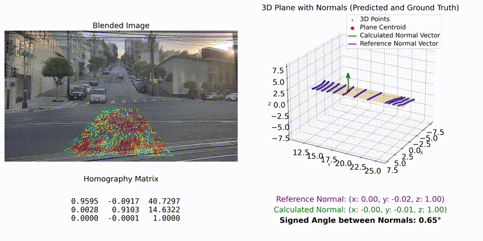

# imu_cam_normal_prediction
Code and supplementary material for the paper "Monocular Ground Normal Prediction for the Road Ahead".

Project website: [https://norbertmarko.github.io/imu_cam_normal_prediction/](https://norbertmarko.github.io/imu_cam_normal_prediction/)



## Cloning the Repository

The commands below are Linux-based. To run the code, you can either use WSL2 with Ubuntu >22.04 or native Ubuntu (tested with 22.04 and 24.04).

Clone project (with submodules):
```bash
git clone --recurse-submodules https://norbertmarko.github.io/imu_cam_normal_prediction/
```
```bash
cd imu_cam_normal_prediction
```
```bash
git submodule update --init --recursive
```

## Installation

Create environment (you need [miniconda](https://docs.anaconda.com/miniconda/install/) for this).

Create conda environment and install dependencies:
```bash
cd imu_cam_normal_prediction
```
```bash
conda env create -f environment.yaml
```

Activate conda environment (every new console used):
```bash
conda activate imu_cam_normal_prediction
```

### PandaSet Devkit

Install `pandaset-devkit` in the environment (only needed for ground truth generation).

```bash
cd src/_ref/pandaset_devkit
```
Activate your conda environment (this is where we pip install the devkit)
```bash
conda activate ground-normal-prediction
```

`cd` into `pandaset_devkit/python` (assuming you are already in `pandaset_devkit`)
```bash
cd python
```
Install the devkit
```bash
pip install .
```

### Download Weights
You can download the pre-trained weights for [EloFTR](https://github.com/zju3dv/EfficientLoFTR) from [here](https://drive.google.com/drive/folders/1GOw6iVqsB-f1vmG6rNmdCcgwfB4VZ7_Q). Put the downloaded `weights` folder into our repository's `src` folder.


## Prepare Evaluation
You can find the example data on the following [link](https://drive.google.com/drive/folders/1tQYw-UU8C_sbC0M1O4lt4fgOCZLZYjis).

1. Download `processed.zip` from the link above and uncompress the data.
2. Modify the `data_root` variable in the  following files in the repository:
    - GradeSet: `src/configs/paths/paths_own.yaml`
        - *it should point to the uncompressed `processed` directory. For example: `"/media/norbert/T7/processed"`*
    - PandaSet: `src/configs/paths/paths_panda.yaml` *(todo: data to be uploaded)*
        - *it should point to the uncompressed `PandaSet` directory. For example: `"/media/norbert/T7/PandaSet"`*
    - KITTI Odometry: `src/configs/paths/paths_kitti.yaml` *(todo: data to be uploaded)*
        - *it should point to the uncompressed `KITTI` directory. For example: `"/media/norbert/T7/kitti/dataset/sequences"`*
3. Download the generated ground truth (`gt_own.zip`) from the link above and uncompress the data.
4. Put the uncompressed ground truth folder into the `results` directory in the repository root.

> **The raw MCAP files can also be inspected by downloading the `clean.zip`.**

## Run Code

> 💡 Before running any of the scripts, go into the repository root, and activate the conda environment as described above.

You can find the generated results in the results directory in the repository root (the sub-folder names should match the script names closely).


### Our Algorithm
To run the algorithm described in the paper, use the main scripts (for each dataset):

GradeSet:
```bash
python src/_experiments/run_exp_hg_own_filter.py seq_num=010
```

PandaSet:
```bash
python src/_experiments/run_exp_hg_panda_filter.py seq_num=029
```

KITTI:
```bash
python src/_experiments/run_exp_hg_kitti_filter.py seq_num=09
```

### Reference Method

You can also run the reference method, using the following python scripts (for each dataset):

GradeSet:
```bash
python src/eval/ref/run_ref_gnf_own.py seq_num=010
```

PandaSet:
```bash
python src/eval/ref/run_ref_gnf_panda.py seq_num=029
```

KITTI:
```bash
python src/eval/ref/run_ref_gnf_kitti.py seq_num=09
```

### Evaluation

Run the evaluation script, after you ran both our method and the SOTA method for a certain sequence:
GradeSet:
```bash
python src/eval/eval.py dataset=own seq_num=010
```

PandaSet:
```bash
python src/eval/eval.py dataset=panda seq_num=029
```

KITTI:
```bash
python src/eval/eval.py dataset=kitti seq_num=09
```

### Troubleshooting

To avoid the following error: `[matplotlib.font_manager][WARNING] - findfont: Font family 'Arial' not found.` Run the following command (move with the arrows and accept with enter when the license agreement appears in the console):
    ```bash
    sudo apt install ttf-mscorefonts-installer && rm -rf ~/.cache/matplotlib
    ```
    - You can still see the evaluation at the top of the console without installing the fonts.

### Re-generate Ground Truth

You can re-generate the ground truth (for any sequence) using the following script (set the `data_root` and `seq_num` in `configs/paths/"chosen dataset".yaml`):

GradeSet:
```bash
python src/gt/gen_gt_normal_own.py
```

PandaSet:
```bash
python src/gt/gen_gt_normal_panda.py
```

KITTI:
```bash
python src/gt/gen_gt_normal_kitti.py
```
